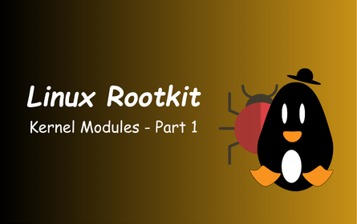
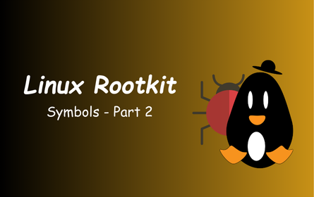

## Malwares, Exploits & Tools

A collection of writeups towards learning how to develop malwares, exploits, and tools
***~# By Z3R0***

| [ZeroMap - Best port scanner for red teamers](Zeromap-best-port-scanner.md) | [Linux-Rootkit-1](Linux-rootkit-kernel-modules-1.md) |
| --------------------------------------------------------------------------- | ---------------------------------------------------- |
|                                                      |                                  |
| [Linux-Rootkit-2](Linux-rootkit-symbols-2.md)                               | SOON                                                 |
|                                                         | SOON                                                 |

