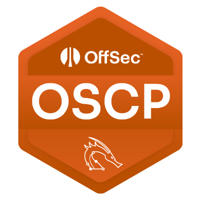
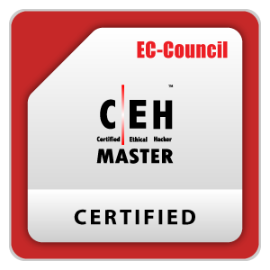
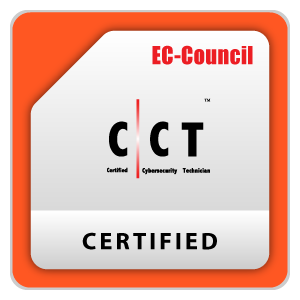
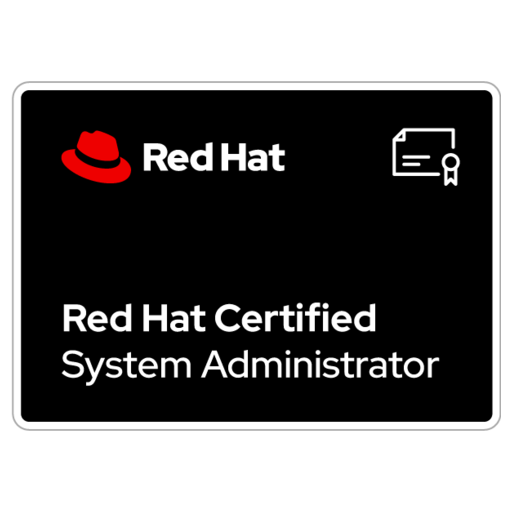

# Whoami - Z3R0
###### *By Prince Patel*

**Offensive Security Researcher | Penetration Tester | Red Teamer**

> *"With curiosity, any system can be owned and with dedication any hack can be stopped."*

---
## 👨‍💻 About Me

I’m an offensive security enthusiast focused on **real-world exploitation, creative attack paths, and deep technical research**.

I don’t just run tools — I break systems apart to understand _why_ they fail. My approach blends structured methodology with curiosity-driven exploration, allowing me to uncover vulnerabilities others might overlook.

Currently on a focused journey toward **OSCP-level mastery**, documenting everything along the way — from enumeration to full domain compromise.

This is not just a certification path.  
It’s a mission to continuously evolve.

---

## 🛠 Core Skills & Technical Arsenal

### 🔍 Offensive Security & Penetration Testing
- End-to-end security assessments across web applications, internal networks, and standalone systems
- Black-box, white-box, and gray-box testing methodologies
- Vulnerability identification, exploitation, and impact validation
- Structured reporting with risk-based analysis and remediation guidance
### 🌐 Application & Web Security
- Identification and exploitation of common and advanced web vulnerabilities
- Authentication, authorization, and business logic testing
- API security assessment
- Secure code review fundamentals and misconfiguration analysis
### 🖥 System Exploitation & Vulnerability Research
- Software vulnerability analysis and exploit development
- Binary analysis and debugging
- Mitigation bypass techniques
- Manual exploitation beyond automated tooling
### 🧠 Reverse Engineering & Analysis
- Static and dynamic binary analysis
- Code deconstruction and behavioral analysis
- Obfuscation analysis and logic reconstruction
### 🏴 Privilege Escalation & Post-Exploitation
- Windows and Linux privilege escalation techniques
- Credential access and lateral movement strategies
- Persistence mechanisms and environment pivoting
- Post-exploitation enumeration and impact assessment
### 🏢 Active Directory & Enterprise Attacks
- Domain enumeration and attack path analysis
- Credential abuse and trust relationship exploitation
- Lateral movement within enterprise environments
- Red team–style domain compromise simulations
### 🔐 Offensive Operations & Red Team Methodology
- Attack chain development and adversary simulation
- Operational security awareness
- Payload customization and controlled execution
- Infrastructure-based testing and lab design

---

## 🎓 Certifications

 
<h4>Offensive Security Certified Professional - Plus (OSCP+)</h4>

<b>Issuer:</b> Offensive Security

 
  

 
<h4>Offensive Security Certified Professional (OSCP)</h4>

<b>Issuer:</b> Offensive Security
 

 

 
<h4>C|EH - Certified Ethical Hacker (Master)</h4>

<b>Issuer:</b> EC-Council

 

 
 
<h4>C|CT - Certified Cybersecurity Technician</h4> 

<b>Issuer:</b> EC-Council

 

 
<h4>CompTIA Security+</h4>

<b>Issuer:</b> CompTIA

 

<h4>RHCSA - Redhat Certified System Administrator</h4>

<b>Issuer:</b> Redhat Enterprise

## 🚀 Featured Projects

### 👾 MalwareAcademy - Malware Documentations

**Date:** Jan 2026 - Present  

**Description:**  
Security research project focused on Linux kernel internals and advanced kernel module development. Explored syscall hooking, stealth techniques, privilege escalation, and modern mitigation bypasses (SMEP/SMAP/KASLR). Developed 40+ proof-of-concept implementations across multiple domains in isolated lab environments for defensive research and detection strategy development.

### 👁️ ZeroEye - Threat Monitoring Tool

**Date:** Jan 2026 - Present  

**Description:**  
Automated threat monitoring tool that tracks Pastebin and GitHub Gists in near real-time to detect phishing, malware, credential leaks, and scams. Implements intelligent keyword detection, IOC extraction, duplicate filtering, and structured logging. Designed to provide early warning intelligence for blue team and threat research operations.

### 🏛️ Hall of Threats - Documentations

**Date:** Nov 2025 - Present  

**Description:**  
Ongoing threat intelligence documentation project analyzing real-world threat actors and their TTPs. Includes attack chain reconstruction, behavioral analysis, and IoC documentation derived from OSINT and active threat hunting. Focused on translating observed attack patterns into actionable defensive insights.

### 🔐 0Password - Secure Offline Password Manager

**Date:** Jul 2025 - Jul 2025  

**Description:**  
Privacy-focused offline password manager built in Python with zero cloud dependencies. Implemented Argon2/PBKDF2 key derivation and encrypted SQLite storage using Fernet (AES + HMAC). Designed for complete local data sovereignty with secure credential handling and portable distribution.

### ⛓️‍💥 Penetration Test and CTF - ENPM685 Grade Server

**Date:** May 2025 - May 2025  

**Description:**  
Conducted a full-scope penetration test on a vulnerable “grade server” as part of a graduate security course. Performed reconnaissance-to-exploitation workflow to capture four hidden flags simulating real-world attack scenarios. Delivered a professional penetration test report and achieved a perfect score.

### 🖥️ Cybersecurity Incident Response Tabletop Exercise - Terrapin, Inc.

**Date:** May 2025 - May 2025  

**Description:**  
Participated in a structured incident response simulation involving a multi-domain Active Directory environment. Assumed IT leadership roles to assess risk, coordinate response actions, and adapt to evolving attack scenarios. Produced a comprehensive post-incident report outlining decisions and lessons learned.

### 💥 Demonstration and Analysis of Malware Attacks and Cyber Threat Vectors

**Date:** Jun 2024 - Jun 2024  

**Description:**  
Undergraduate capstone project demonstrating phishing, reverse shell, and ransomware attack simulations in controlled lab environments. Analyzed threat actors and common attack vectors while showcasing practical exploitation techniques. Focused on awareness, detection, and defensive strategy reinforcement.

---

## 🧭 Final Word

Security is not a destination — it’s a continuous pursuit of understanding how systems break and how they can be strengthened.

My goal is not just to earn certifications, but to develop the depth required to operate at a professional offensive security level — where creativity, precision, and discipline intersect.

Every lab, every exploit, and every writeup is a step toward mastery.

The journey continues.

